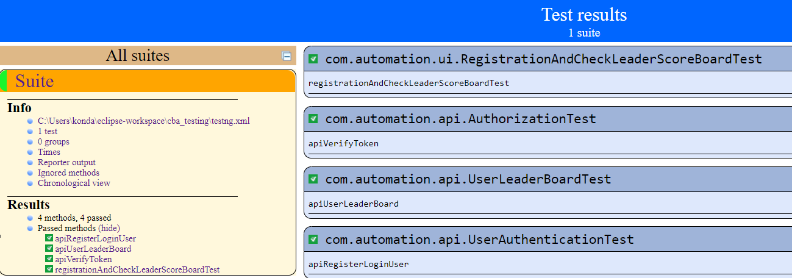

### Web UI & API Automation framework 

Running the testng.xml will run all the tests written in this project.

#### Web UI Automation framework
Used Selenium and Test NG for Web UI Automation.

**RegistrationAndCheckLeaderScoreBoardTest** - This test demonstrates the registration and login process to https://responsivefight.herokuapp.com/ UI. 
And then goes through some challenges and then checks the leader board.
This test also validates whether the user created in this process is present on leader board or not.
Used WebDriverManager class(io.github.bonigarcia.wdm.WebDriverManager) so that the test can be run from anywhere without having a dependency on local browser drivers.
Currently these tests are defaulted to run on Chrome Browser. 

#### API Automation framework 
Used Rest-Assured and TestNG for API Automation.

Before running the API tests, please generate Authentication token and update the token in the following location(the current token might get expired by the time these tests are run at your end) -
Package - automation.api
Java Class - APITestData.java
String Parameter - apiToken

**AuthorizationTest** - This test validates the generated token. If the token is valid, then 200 will be received as HTTP response code & assertion in this test will be passed. If the token is invalid, then 403 will be received as HTTP response code and assertion in this test will not be passed as the expected code is 200.
**UserAuthenticationTest** - This test demonstrates Registration and Authentication of users via API calls. This test will be passed if HTTP Response error code received would be 200 for both the APIs. Created a method to generate a random username.
**UserLeaderBoardTest** - This test demonstrates testing of GET, POST, PUT APIs of User Leaderboard. Added assertions to check HTTP Response codes.

**Maven is used as a dependency management tool, pom.xml has all the dependencies used in this project**
selenium-java - To integrate the maven project with Selenium.
testng - To integrate the maven project with TestNG framework.
maven-surefire-plugin - To generate beautiful reports once the tests are run to see the status(pass/fail) of tests.
webdrivermanager - This is used to run from anywhere without having a dependency on local browser drivers.
rest-assured - This is used for API automation.
json - This is used to generate JSON requests for both POST and PUT requests.

**Automation Test Results**

